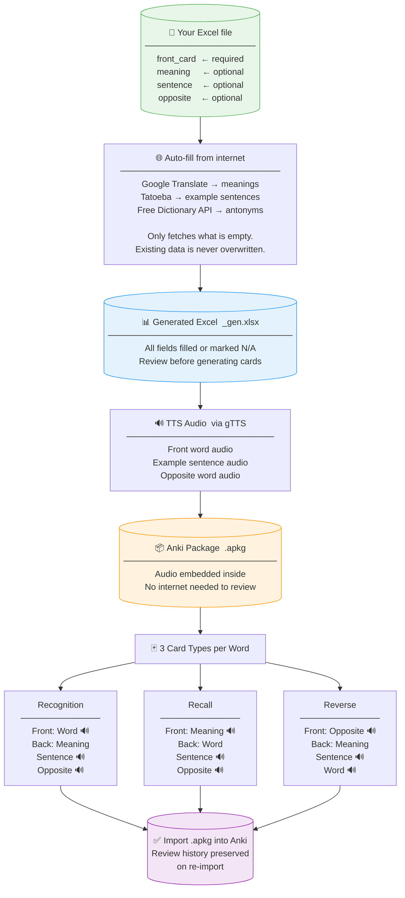

# Anki Card Generator

Generate Anki flashcard packages (`.apkg`) with embedded TTS audio from a simple Excel file.  
Just put your words in — the tool auto-fills meanings, example sentences, and opposites from the internet, then bakes audio directly into the package so no internet is needed when reviewing.

**Current version: v2.2.6**

---

## How It Works — Big Picture



---

## Quick Start

### Option 1: Standalone App (Windows, no Python needed)

1. Download `AnkiCardGenerator_v2.2.6_win.exe` from the [Releases](../../releases) page
2. Double-click to launch
3. Drag your Excel file onto the window (or click Browse)
4. Set deck name and language
5. Click **Generate Anki Cards**
6. Double-click the `.apkg` file to import into Anki

### Option 2: Python Script

```bash
pip install genanki gtts deep-translator openpyxl tkinterdnd2
python gen_anki_gui.py
```

Or command line:

```bash
python gen_anki.py --input my_words.xlsx --lang vi --deck "Vietnamese"
```

---

## Input File Format

Excel (`.xlsx`) or CSV with a header row. **Only `front_card` is required** — everything else is auto-filled.

| Column | Required | Auto-filled? | Description |
|--------|----------|--------------|-------------|
| `front_card` | Yes | No | Word to learn |
| `front_card_reading` | No | Yes (Japanese) | Hiragana reading for Japanese words |
| `back_card_meaning` | No | Yes | English meaning (Google Translate) |
| `back_card_sentence` | No | Yes | Example sentence (Tatoeba) |
| `back_card_sentence_meaning` | No | Yes | English translation of sentence |
| `back_card_opposite` | No | Yes | Antonym/opposite word |
| `back_card_opposite_meaning` | No | Yes | English meaning of opposite |

Columns are matched by **name, not position** — reorder freely.

### Minimal example

| front_card |
|------------|
| xin chào   |
| cảm ơn     |
| đẹp        |

### Pre-filled example (tool keeps existing data, only fills what's missing)

| front_card | back_card_meaning | back_card_opposite |
|------------|-------------------|--------------------|
| nóng       | hot               | lạnh               |
| to         |                   | nhỏ                |
| sách       |                   |                    |

Demo files are in the `how_to_use/` folder.

---

## How It Works

1. Script reads your Excel → fills empty fields via internet → writes `<name>_gen.xlsx`
2. Generates `.apkg` with TTS audio embedded for each word, sentence, and opposite

**Smart lookup — only fetches what's missing:**
- Field already has data → kept as-is, no internet call
- All fields filled → row skipped entirely (fast re-runs)
- Field not found after lookup → marked `N/A` (skipped on future runs too)

---

## Card Types Generated

| Card Type | Front | Back |
|-----------|-------|------|
| Recognition | Word + audio | Meaning, sentence + audio, opposite + audio |
| Recall | Meaning + audio | Word, sentence + audio, opposite + audio |
| Reverse | Opposite word + audio | Meaning, sentence + audio, original word |

Reverse and Recall cards can be toggled off in the GUI.

---

## GUI Features

- Drag and drop `.xlsx` or `.csv` files
- Language dropdown (17 languages + auto-detect)
- Output folder and audio cache folder selectors
- Reverse cards / Recall cards / Regenerate all data toggles
- Real-time log during generation
- **Text-to-Speech tab** — generate standalone MP3 or karaoke-style video from any text
- Settings auto-saved across restarts (`~/.anki_card_generator/gui_settings.json`)
- Install Packages button

---

## Supported Languages

`auto` (detect from characters), `vi`, `en`, `ja`, `ko`, `zh-CN`, `zh-TW`, `th`, `id`, `ms`, `fr`, `de`, `es`, `pt`, `it`, `ru`, `ar`, `hi`

---

## Command Line Options

| Option | Default | Description |
|--------|---------|-------------|
| `--input` | required | Path to `.xlsx` or `.csv` |
| `--lang` | `auto` | Language code for TTS |
| `--deck` | `Anki_deck` | Anki deck name |
| `--output` | Downloads folder | Output directory |
| `--no-reverse` | | Disable reverse cards |
| `--no-recall` | | Disable recall cards |
| `--data-only` | | Only generate `_gen.xlsx`, skip `.apkg` |
| `--cache-dir` | same as output | Audio cache folder |

---

## Re-importing / Incremental Updates

- Same front word → same note ID → Anki **preserves review history**
- New words → added as new cards
- No duplicates on re-import

Always use the same deck name when updating an existing deck.

---

## Data Sources

| Source | Used For |
|--------|----------|
| [Tatoeba](https://tatoeba.org) | Real example sentences (400+ languages, no API key) |
| [Free Dictionary API](https://dictionaryapi.dev) | Antonyms, English examples (no API key) |
| [Google Translate](https://translate.google.com) | Word meanings, sentence translations |

---

## Dependencies

```bash
pip install genanki gtts deep-translator openpyxl tkinterdnd2
```

Optional (Japanese furigana support):
```bash
pip install pykakasi
```

---

## Building the Exe

```bash
python build_exe.py
```

Output: `dist/AnkiCardGenerator_v2.2.6_win.exe`  
Build on each platform separately (Windows/macOS/Linux auto-detected).

---

## Project Structure

```
├── gen_anki.py          # Core engine (CLI)
├── gen_anki_gui.py      # GUI wrapper
├── build_exe.py         # PyInstaller build script
├── cards_input.xlsx     # Input template
└── how_to_use/
    ├── quick_start.md
    ├── how_to_use.md
    ├── CHANGELOG.md
    ├── demo_vietnamese.xlsx
    ├── demo_korean.xlsx
    └── demo_partial_data.xlsx
```
